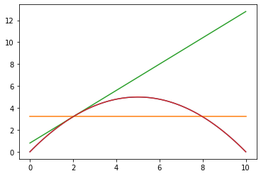

# Deret Taylor
## Pengenalan
Deret Taylor adalah suatu cara untuk mengekspresikan fungsi matematika sebagai jumlah deret tak berhingga dari suku-suku yang ditentukan berdasarkan turunan fungsi tersebut di suatu titik. Misalkan kita ingin mengestimasi fungsi eksponensial $f(x) = e^x$ di sekitar titik $x=x_0$. Kita perlu menentukan turunan ke-n dari fungsi tersebut dan mengevaluasinya pada titik $x_0$. Deret Taylor sangat berguna dalam matematika dan banyak digunakan dalam bidang sains dan rekayasa. Deret Taylor pertama kali diperkenalkan oleh matematikawan Inggris, Brook Taylor, pada abad ke-18.

Deret Taylor terdiri dari dua jenis, yakni Deret Taylor dan Deret McLaurin. Deret Taylor adalah deret yang digunakan untuk mengekspresikan fungsi pada titik tertentu yang tidak harus nol. Sedangkan Deret McLaurin adalah kasus khusus dari Deret Taylor, di mana titik yang digunakan adalah nol. Dalam artikel ini, kita akan membahas Deret Taylor secara umum.

## Bentuk Umum
Bentuk umum dari Deret Taylor adalah sebagai berikut:

$$f\left(x+\varDelta x\right)=f\left(x\right)+\dfrac{\varDelta x}{1!}f'\left(x\right)+\dfrac{\varDelta x^{2}}{2!}f''\left(x\right)+\cdots+\dfrac{\varDelta x^{n}}{n!}f^{\left(n\right)}\left(x\right)+\cdots \tag{1a}$$

atau 

$$ f(x+\Delta x) = \sum^{\infty}_{n=0} {f^{(n)}(x)\over n!} (\Delta x)^n \tag{1b}$$  
 
di mana $f^{(n)}(x)$ adalah turunan ke-$n$ dari fungsi $f(x)$ yang dievaluasi pada titik $x$. Dalam kata lain, persamaan di atas dapat digunakan untuk mengekspresikan nilai dari fungsi $f(x)$ di sekitar titik $x$ sebagai jumlah tak berhingga dari suku-suku deret, dengan setiap suku didasarkan pada nilai turunan fungsi tersebut di titik $x$.


## Contoh 1
Mari kita lihat contoh penggunaan Deret Taylor. Misalnya kita ingin mengestimasi kecepatan suatu sungai. Seandainya kecepatan sebuah sungai memenuhi persamaan: 

$$ f(x) = -0.2 x^2+2x \tag{2} $$ 

Lalu kita mengukur kecepatan di titik $x = 1$. Dari Persamaan 2, didapatkan f(1) = 1.8 m/s. Seandainya data yang kita punya hanya kecepatan di titik $ x = 1 $ dan Persamaan 2, dan kita ingin mengestimasi kecepatan pada x = 2, kita bisa menggunakan deret Taylor untuk mengestimasinya.


Dengan $ x = 1, \Delta x = 1, f(1) = 1.8, f'(1) = 1.6, f"(1) = -0.4, f^{(3)} = 0 $, karena setelah turunan ke-3, nilai turunannya adalah nol, maka kita hentikan penurunannya. Dari Persamaan (1) kita dapatkan:

$$ f(1 + 1) = f(2) = f(1) + f'(1) \Delta x + {f''(1) \Delta x^2 \over 2 !} = 3.2$$

Dari hasil estimasi kecepatan pada titik $ x = 2 $, hasil dari deret Taylor sama dengan hasil nilai eksak, yaitu 3.2 m/s.

---


Mungkin kita berpikir kalau kita bisa menggunakan persamaan di Contoh 1 untuk menghitung nilai eksak-nya kenapa harus menggunakan deret Taylor? Sayangnya pada banyak kondisi kita tidak tahu persis persamaan kecepatan melintang sepanjang lebar selokan, kita hanya tahu nilai kecepatannya dan turunan (misalnya) pertama atau keduanya, sehingga kita butuh deret Taylor. 

Contoh lainnya misalnya kita ingin mengetahui perubahan posisi pada sebuah benda bergerak tanpa mengetahui persamaan geraknya. Kita hanya bisa mengukur posisi $x_0$, kecepatan (turunan pertama posisi terhadap waktu), dan percepatan (turunan kedua) saat $ t = 1 $. Kita ingin mengestimasi posisi benda bergerak tersebut saat $ t = 2 $, maka kita butuh deret Taylor, karena kita tidak mempunyai persamaan geraknya. 


## Orde Deret Taylor

Jika kita hanya menggunakan suku pertama pada Persamaan 1, maka deret Taylor yang kita gunakan adalah deret Taylor orde 0, dan Persamaan 1 menjadi:

$$ f(x + \Delta x) = f(x) + R_0 \tag{3}$$

dengan:
$$ R_0 = O(\Delta x) = \dfrac{\varDelta x}{1!}f'\left(x\right)+\dfrac{\varDelta x^{2}}{2!}f''\left(x\right)+\cdots+\dfrac{\varDelta x^{n}}{n!}f^{\left(n\right)}\left(x\right)+\cdots \tag{4}$$

$ R_0 = O(\Delta x) $ adalah galat pemotongan (*truncating error*) yang berorde 1. Jika kita melanjutkan deret Taylor hingga suku ke-2, maka orde deret taylor tersebut adalah 1 dengan persamaan:

$$ f(x + \Delta x) = f(x) + \dfrac{\varDelta x}{1!}f'\left(x\right) + R_1 \tag{4}$$

dengan:

$$ R_1 = O(\Delta x^2) = \dfrac{\varDelta x^{2}}{2!}f''\left(x\right)+\cdots+\dfrac{\varDelta x^{n}}{n!}f^{\left(n\right)}\left(x\right)+\cdots \tag{5}$$


$ R_1 = O(\Delta x^2) $ adalah galat pemotongan yang berorde 2. Dan seterusnya.

Mungkin kita berpikiran kalau bisa kita


## Contoh 2

Seperti pada Contoh 1, estimasilah kecepatan pada titik yang sama menggunakan deret Taylor orde ke-0, ke-1, dan ke-2. Serta hitunglah kesalahan pada masing-masing kasus!


### Jawab:

Dengan data yang diperoleh dari jawaban contoh 1, kita dapatkan:

**Orde ke-0**
 $$ f(1 + 1) = f(2) = f(1) = 1.8$$

 dengan kesalahan absolut sejati (*true relative error*) $ \epsilon_t = 43.75 \% $.

 **Orde ke-1**

 $$ f(1 + 1) = f(2) = f(1) + f'(1) \Delta x = 3.4$$


 dengan kesalahan absolut sejati (*true relative error*) $ \epsilon_t = 6.25 \% $. 

 **Orde ke-2**

 $$ f(1 + 1) = f(2) = f(1) + f'(1) \Delta x + {f''(1) \Delta x^2 \over 2 !} = 3.2$$

 dengan kesalahan absolut sejati (*true relative error*) $ \epsilon_t = 0.0 \% $. 

 ---
 
 

Pada kebanyakan kasus *engineering*, kita hanya menggunakan beberapa suku pertama pada deret Taylor, kita jarang menggunakan deret Taylor hingga orde yang sangat tinggi.

## Galat Pemotongan

<!-- Dari uraian sebelumnya, galat pemotongan didefinisikan sebagai galat yang timbul karena pemotongan deret Taylor. -->

Jika fungsi pada contoh 1 kita plot-kan pada sebuah grafik, serta deret Taylor orde ke-0, 1, dan 2 dari fungsi tersebut kita gunakan untuk mengestimasi nilai $f(x)$ pada $ 0 \le x \le 10 $ dan kita plotkan pada grafik yang sama, maka akan membentuk kurva seperti pada Gambar di bawah ini:


```python
# Kode sengaja di perlihatkan untuk pembelajaran

import matplotlib.pyplot as plt # mengimport modul untuk ploting
import numpy as np # mengimport modul untuk numerik
import math # mengimport modul matematika

```


```python
x = np.linspace(0, 10, 101)
y = -0.2*x**2 + 2*x

fig, ax = plt.subplots()
ax.plot(x, y)

dx = 2
# Orde ke - nol
x0 = 2
fx0 =  -0.2*x0**2 + 2* x0  #f'x0)

# list atau array nilai estimasi y dengan deret Taylor orde ke-0
y_0 = [fx0 for i in x]
ax.plot(x, y_0)

# orde ke - 1
f1x0 = -0.4*x0 + 2 #f'(x0)

# list atau array nilai estimasi y dengan deret Taylor orde ke-1
y_1 = y_0 + f1x0 * (x - x0)
ax.plot(x, y_1)

# orde-2
f2x0 = -0.4
y_2 = y_1 + f2x0 * (x - x0)**2/2
ax.plot(x, y_2)
# print(g0)

```


    [<matplotlib.lines.Line2D at 0x22d9a8daf88>]





Kurva oranye yang berupa garis lurus adalah kurva untuk deret Taylor orde ke-0, kurva hijau yang berupa garis linear adalah kurva untuk deret Taylor orde ke-1, sedangkan kurva merah yang berhimpit dengan kurva nilai eksak adalah kurva deret Taylor orde ke-2. Dari sini terlihat bahwa kurva deret Taylor orde ke-2 mempunyai galat sama dengan nol, sehingga hasil deret Taylor untuk persamaan tersebut adalah eksak. Secara umum deret Taylor mampu menghasilkan nilai eksak pada persamaan polinomial pangkat ke-n jika menggunakan orde ke-n.

Pada Contoh 1 dan 2 kita mengestimasi persamaan dengan $\Delta x = 1$, seandainya kita kita memperkecil $\Delta x$ apa yang akan terjadi?

&nbsp;


<div>
<style scoped>
    .dataframe tbody tr th:only-of-type {
        vertical-align: middle;
    }

    .dataframe tbody tr th {
        vertical-align: top;
    }

    .dataframe thead th {
        text-align: right;
    }
</style>
<table border="1" class="dataframe">
  <thead>
    <tr style="text-align: right;">
      <th></th>
      <th>dx</th>
      <th>galat 0</th>
      <th>galat 1</th>
    </tr>
  </thead>
  <tbody>
    <tr>
      <th>0</th>
      <td>1.000000</td>
      <td>43.750000</td>
      <td>6.250000</td>
    </tr>
    <tr>
      <th>1</th>
      <td>0.500000</td>
      <td>29.411765</td>
      <td>1.960784</td>
    </tr>
    <tr>
      <th>2</th>
      <td>0.250000</td>
      <td>17.714286</td>
      <td>0.571429</td>
    </tr>
    <tr>
      <th>3</th>
      <td>0.125000</td>
      <td>9.859155</td>
      <td>0.156495</td>
    </tr>
    <tr>
      <th>4</th>
      <td>0.062500</td>
      <td>5.224188</td>
      <td>0.041135</td>
    </tr>
    <tr>
      <th>5</th>
      <td>0.031250</td>
      <td>2.692430</td>
      <td>0.010559</td>
    </tr>
    <tr>
      <th>6</th>
      <td>0.015625</td>
      <td>1.367224</td>
      <td>0.002676</td>
    </tr>
    <tr>
      <th>7</th>
      <td>0.007812</td>
      <td>0.688986</td>
      <td>0.000673</td>
    </tr>
    <tr>
      <th>8</th>
      <td>0.003906</td>
      <td>0.345852</td>
      <td>0.000169</td>
    </tr>
    <tr>
      <th>9</th>
      <td>0.001953</td>
      <td>0.173268</td>
      <td>0.000042</td>
    </tr>
  </tbody>
</table>
</div>


&nbsp;

Pada tabel di atas, galat 0 dan 1 menunjukkan galat pada deret taylor orde ke-0 dan ke-1 secara berturut-turut. jia kita perhatikan, saat dx di perkecil menajadi setengah, maka galat pada deret Taylor orde ke-0 akan mengecil menjadi $\pm $ separuhnya, sedangkan  pada deret Taylor orde ke-1 akan mengecil menjadi $\pm$ 0.25. Hal ini sesuai dengan Persamaan 4 dan 5, karena yang paling berpengaruh pada galat adalah pangkat pada $\Delta x$ suku pertamanya. Sedangkan ketidak tepatan pengecilan galat menjadi separuh dan seperempat adalah kontribusi variabal pada suku pertama selain $\Delta x$ dan suku-suku tidak hingga setelahnya.  

## Kesimpulan

Dari contoh dan penjelasan di atas kita bisa mengetahui bahwa deret Taylor adalah suatu cara untuk mengekspresikan fungsi matematika sebagai jumlah deret tak berhingga dari suku-suku yang ditentukan berdasarkan turunan fungsi tersebut pada suatu titik. Hasil estimasi dengan deret Taylor mengandung galat jika kita memotong deretnya.
