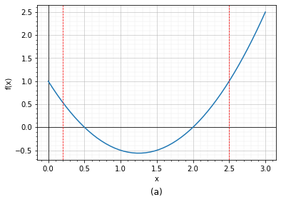

# Akar-akar persamaan

Akar persamaan adalah nilai-nilai variabel yang memenuhi suatu persamaan matematika. Persamaan matematika merupakan ungkapan yang menyatakan kesetaraan (*equal*) antara suatu ekspresi dengan nilai tertentu. Sebagai contoh misalnya kita diminta untuk mencari nilai *x* yang memenuhi persamaan $f(x) = ax + c$. Semua nilai *x* yang memenuhi persamaan tersebut adalah akar-akar persamaan.  Setiap persamaan matematika memiliki akar atau solusi yang mungkin berupa bilangan riil atau kompleks. Penyelesaian akar persamaan ini memiliki banyak aplikasi dalam berbagai bidang, termasuk matematika, fisika, dan teknik.

## Solusi akar persamaan
Dalam penyelesaian akar persamaan, kita akan mencari nilai dari variabel x yang memenuhi persamaan tersebut. Kita akan menggunakan beberapa metode untuk menyelesaikan persamaan ini, termasuk metode faktorisasi, metode substitusi, dan metode grafik.

Salah satu metode yang umum digunakan dalam menyelesaikan persamaan adalah metode faktorisasi. Metode ini digunakan untuk mencari akar dari persamaan yang memiliki bentuk faktorisasi. Persamaan yang dapat difaktorisasi dibawa kebentuk:

$$ (a_1x + b_1)(a_2x + b_2) \dots (a_nx + b_n) = 0 \label{eq:faktor}$$ 

Untuk menyelesaikan persamaan ini, kita harus mencari nilai dari *x* yang membuat faktor-faktor di atas menjadi nol, lalu dicari nilai $x$-nya. Sebagai contoh, Persamaan \ref{eq:faktor} kita ubah menjadi $a_ix + b_i = 0$, kemudian kita cari nilai masing-masing *x*-nya.

Metode substitusi adalah metode lain yang umum digunakan untuk menyelesaikan persamaan. Metode ini melibatkan penggantian variabel x dengan variabel baru atau nilai tertentu yang kita tentukan. Kita akan mensubstitusikan nilai atau variabel tertentu pada persamaan hingga persamaan tersebut terpenuhi.

Karena tidak semua persamaan bisa/mudah difaktorkan, dan metode substitusi sederhana juga bergantung dengan tebakan, kedua metode tersebut sangat sulit untuk diterapkan pada permasalahan yang kompleks. Maka cara yang lebih mudah adalah menggunakan metode grafik.

Mencari akar persamaan dengan metode grafik adalah dengan mengplotkan nilai *x* dan *f(x)* dari sebuah persamaan, lalu dicari perpotongan dengan sumbu-x. Sebagai contoh misalnya persamaan:

$$ f(x) = 2x^2 - 5x + 1 \notag $$

Persamaan tersebut cukup susah diselesaikan dengan cara faktorisasi dan substitusi, cara yang paling mudah adalah dengan menggambarkan kurva persamaan tersebut. Pertama-tama Kita cari nilai *x* dan *f(x)* yang memenuhi persamaan di atas, lalu nilai-nilai tersebut kita plotkan pada sebuah grafik:

<table border="1" class="dataframe">
  <thead>
    <tr style="text-align: right;">
      <th></th>
      <th>x</th>
      <th>y</th>
    </tr>
  </thead>
  <tbody>
    <tr>
      <th>0</th>
      <td>0.000000</td>
      <td>1.000000</td>
    </tr>
    <tr>
      <th>1</th>
      <td>0.333333</td>
      <td>-0.444444</td>
    </tr>
    <tr>
      <th>2</th>
      <td>0.666667</td>
      <td>-1.444444</td>
    </tr>
    <tr>
      <th>3</th>
      <td>1.000000</td>
      <td>-2.000000</td>
    </tr>
    <tr>
      <th>4</th>
      <td>1.333333</td>
      <td>-2.111111</td>
    </tr>
    <tr>
      <th>5</th>
      <td>1.666667</td>
      <td>-1.777778</td>
    </tr>
    <tr>
      <th>6</th>
      <td>2.000000</td>
      <td>-1.000000</td>
    </tr>
    <tr>
      <th>7</th>
      <td>2.333333</td>
      <td>0.222222</td>
    </tr>
    <tr>
      <th>8</th>
      <td>2.666667</td>
      <td>1.888889</td>
    </tr>
    <tr>
      <th>9</th>
      <td>3.000000</td>
      <td>4.000000</td>
    </tr>
  </tbody>
</table>

Dari grafik tersebut kita bisa mengetahui bahwa persamaan tersebut mempunyai dua akar yang bernilai sekitar $\pm$ 0.2 dan $\pm$ 2.3. Meskipun kita dengan mudah mendapatkan nilai ancer-ancer dari akar persamaan dengan metode grafik, tetapi kita sukar menentukan nilai tepatnya. Untuk mengatasi masalah ini, kita nanti akan menggunakan metode numerik.

## Kurva dan akar persamaan

Salah satu cara dalam menentukan akar persamaan, adalah kita menebak dua nilai $x_1$ dan $x_2$ lalu kita cari nilai $f(x_1)$ dan $f(x_2)$ (lihat gambar). Secara umum, jika fungsi tersebut kontinyu pada rentang $x_1 - x_2$, maka jika $f(x1)$ berlawanan tanda dengan $f(x_2)$, maka di antara rentang tersebut terdapat minimum satu akar, atau beberapa akar yang jumlahnya ganjil (lihat gambar c dan d). Meskipun pada Gambar(c) terlihat terdapat satu akar, sebenarnya pada kurva tersebut terdapat tiga akar kembar $x = 2$. Akar kembar membuat garis singgung kurva menjadi nol (sejajar sumbu x), sehingga akan timbul *inflection point*. Semakin banyak akar yang sama, maka kurva yang dibentuk disekitar titik tersebut akan semakin datar.

Pada gambar selain c dan d, nilai $f(x_1)$ dan $f(x_2)$ mempunyai tanda yang sama. Hal ini menunjukkan bahwa pada rentang $x_1$ dan $x_2$ bisa ada akar atau tidak sama sekali, jika rentang tersebut mempunyai akar, maka akarnya akan genap.

<!-- Sebagai contoh

Metode iterasi juga merupakan metode yang sering digunakan dalam menyelesaikan persamaan. Metode ini melibatkan pengulangan proses untuk mencari akar persamaan. Metode iterasi terutama digunakan untuk menyelesaikan persamaan yang tidak dapat diselesaikan dengan cara yang sederhana. Dalam metode ini, kita akan memulai dengan nilai awal x, kemudian mengulangi proses untuk mencari nilai x yang lebih dekat dengan nilai sebenarnya. Proses ini dilakukan sampai nilai x yang diperoleh sudah cukup mendekati nilai sebenarnya.

Selain metode-metode di atas, terdapat juga metode numerik lainnya yang dapat digunakan untuk menyelesaikan persamaan. Beberapa contoh metode numerik tersebut adalah metode eliminasi Gauss, metode eliminasi Gauss-Jordan, dan metode interpolasi. Metode numerik ini lebih kompleks dan sering digunakan dalam perhitungan yang membutuhkan presisi yang tinggi.

Dalam kesimpulannya, penyelesaian akar persamaan adalah proses untuk menemukan nilai variabel yang memenuhi persamaan matematika. Ada banyak metode yang dapat digunakan untuk menyelesaikan persamaan, termasuk metode faktorisasi, metode substitusi, dan metode iterasi. Dalam menyelesaikan persamaan, kita harus mempertimbangkan faktor-fakt-faktor seperti bentuk persamaan, jenis persamaan, dan kemungkinan solusi yang mungkin. Metode yang digunakan tergantung pada situasi dan kondisi yang sedang dihadapi. Metode numerik yang lebih kompleks sering digunakan dalam perhitungan yang membutuhkan presisi yang tinggi, sementara metode sederhana seperti faktorisasi dan substitusi dapat digunakan dalam kasus yang lebih mudah.

Dalam menyelesaikan persamaan, penting untuk memahami konsep akar dan solusi, serta cara menghitung akar persamaan. Akar persamaan sering digunakan dalam berbagai bidang, termasuk matematika, fisika, dan teknik. Oleh karena itu, pemahaman yang kuat tentang konsep ini sangat penting bagi siapa saja yang ingin belajar atau mengaplikasikan matematika.

Secara umum, untuk menyelesaikan persamaan, kita perlu mengenal beberapa jenis persamaan seperti persamaan linier, persamaan kuadrat, persamaan eksponensial, persamaan logaritmik, persamaan trigonometri, dan persamaan diferensial. Masing-masing jenis persamaan memerlukan metode yang berbeda untuk menyelesaikan.

Persamaan linier, misalnya, memiliki bentuk ax + b = 0, di mana a dan b adalah konstanta. Persamaan ini dapat diselesaikan dengan mudah menggunakan metode substitusi atau metode faktorisasi.

Persamaan kuadrat memiliki bentuk ax^2 + bx + c = 0, di mana a, b, dan c adalah konstanta. Persamaan ini dapat diselesaikan menggunakan rumus kuadrat atau dengan menggunakan metode faktorisasi.

Persamaan eksponensial memiliki bentuk a^x = b, di mana a dan b adalah konstanta. Persamaan ini dapat diselesaikan dengan mengambil logaritma alami dari kedua sisi persamaan, dan kemudian menyelesaikan persamaan untuk x.

Persamaan logaritmik memiliki bentuk log_a(x) = b, di mana a dan b adalah konstanta. Persamaan ini dapat diselesaikan dengan mengubah bentuk persamaan menjadi bentuk eksponensial, dan kemudian menyelesaikan persamaan untuk x.

Persamaan trigonometri memiliki bentuk sin(x) = a, cos(x) = a, atau tan(x) = a, di mana a adalah konstanta. Persamaan ini dapat diselesaikan dengan menggunakan rumus trigonometri atau dengan menggunakan metode substitusi.

Persamaan diferensial adalah persamaan yang melibatkan turunan suatu fungsi. Persamaan ini dapat diselesaikan menggunakan berbagai teknik, termasuk metode pemisahan variabel, metode reduksi orde, dan metode operator diferensial.

Dalam menyelesaikan persamaan, ada beberapa hal yang perlu diperhatikan, seperti memperhatikan syarat dan batasan dalam persamaan, menghilangkan variabel yang sama pada kedua sisi persamaan, serta memeriksa kembali jawaban yang diperoleh. Selain itu, dalam beberapa kasus, persamaan dapat memiliki lebih dari satu akar, sehingga semua solusi perlu dipertimbangkan.

Setelah menyelesaikan persamaan, langkah selanjutnya adalah mencari akar persamaan. Akar persamaan adalah nilai-nilai yang dapat digunakan untuk menggantikan variabel dalam persamaan sehingga persamaan menjadi benar. Dalam persamaan kuadrat ax^2 + bx + c = 0, akar persamaan dapat dihitung menggunakan rumus kuadrat x = (-b ± √(b^2-4ac)) / 2a. Persamaan linier ax + b = 0 memiliki satu akar yang dapat dihitung dengan rumus x = -b/a.

Dalam persamaan yang lebih kompleks, seperti persamaan trigonometri dan persamaan diferensial, akar persamaan dapat ditemukan dengan menggunakan metode analitis atau metode numerik. Metode analitis melibatkan penyelesaian persamaan secara matematis, sedangkan metode numerik melibatkan penggunaan algoritma dan perhitungan komputer untuk mencari akar persamaan.

Dalam beberapa kasus, akar persamaan dapat memiliki nilai riil atau nilai kompleks. Nilai riil berarti bahwa akar persamaan dapat ditemukan di bilangan riil, sedangkan nilai kompleks berarti bahwa akar persamaan berada di bilangan kompleks. Bilangan kompleks adalah bilangan yang terdiri dari bagian real dan bagian imajiner, dan ditulis dalam bentuk a + bi, di mana a dan b adalah bilangan real dan i adalah satuan imajiner, yaitu akar kuadrat dari -1.

Dalam beberapa situasi, akar persamaan dapat digunakan untuk memodelkan dan memprediksi fenomena di dunia nyata. Misalnya, dalam fisika, persamaan gerak dapat digunakan untuk memprediksi gerakan benda, sedangkan dalam ekonomi, persamaan matematika dapat digunakan untuk memprediksi tren pasar. Oleh karena itu, pemahaman yang kuat tentang konsep akar persamaan sangat penting dalam berbagai bidang ilmu pengetahuan dan teknologi.

Dalam kesimpulan, akar persamaan adalah nilai-nilai yang dapat digunakan untuk menggantikan variabel dalam persamaan sehingga persamaan menjadi benar. Untuk menyelesaikan persamaan dan mencari akar persamaan, dibutuhkan pemahaman yang kuat tentang berbagai jenis persamaan dan metode yang digunakan untuk menyelesaikannya. Akar persamaan dapat memiliki nilai riil atau kompleks dan dapat digunakan untuk memprediksi dan memodelkan fenomena di dunia nyata.

 -->
